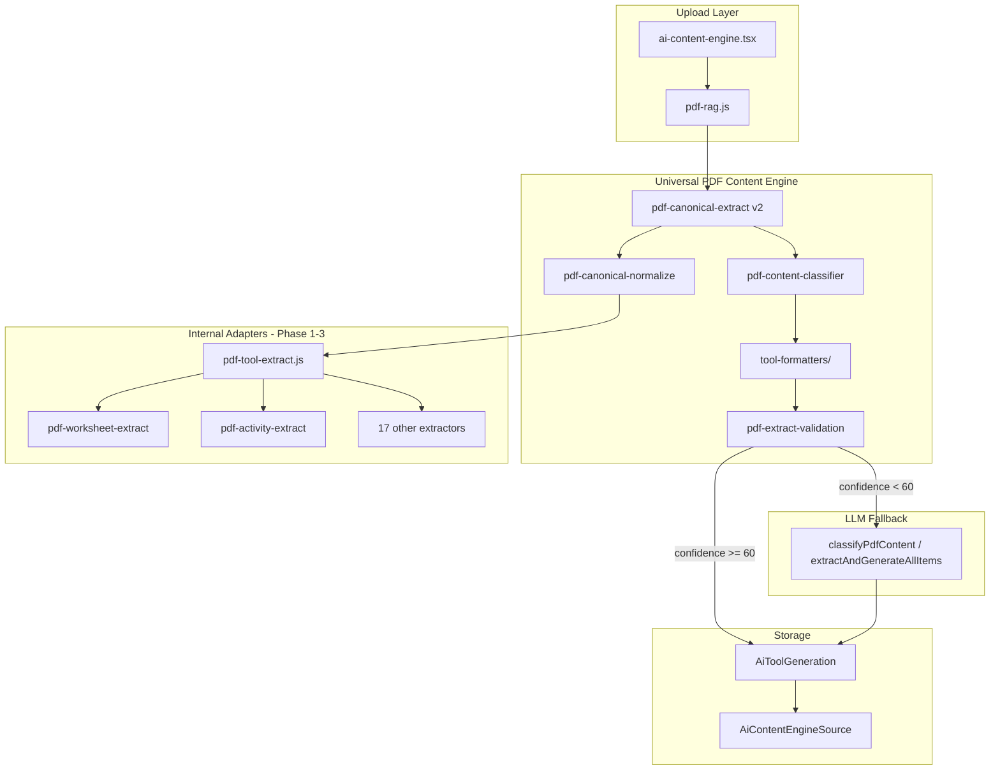

# AsliLearn Universal PDF Content Engine — Migration Plan

## Current state (March 2026)

- **22 AI tools** in `config/aiToolTemplates.js` (`AI_TOOL_ORDERED_SLUGS`)
- **24** `pdf-*.js` service files; extraction logic duplicated per tool
- **Partial canonical layer** already exists: `pdf-canonical-extract.js` (v1), `pdf-canonical-mapper.js`
- **Upload orchestration** in `routes/pdf-rag.js` → `resolvePdfUploadBulkItems()`
- **Formatters** live in monolithic `ai-content-engine-service.js` (7500+ lines)
- **Worksheet zero-LLM path** is production-critical (124+ questions, 0 tokens)
- **Gemini** used for: classify, extract fallback, RAG generation

## Target architecture

```
PDF Upload
    ↓
Text Extraction (pdf-parse)
    ↓
Canonical Content Engine (pdf-canonical-extract v2)
    ↓
Content Classifier (pdf-content-classifier — rules, no Gemini)
    ↓
Tool Formatter (services/tool-formatters/*)
    ↓
Database Save (AiToolGeneration + AiContentEngineSource)
```

Gemini **only** when: `confidence < 60` OR extraction fails OR OCR quality poor.

---

## Files to KEEP (reuse)

| File | Role in new architecture |
|------|--------------------------|
| `pdf-canonical-extract.js` | **Expand to v2** — single parse entry |
| `pdf-canonical-mapper.js` | Bridge until formatters fully migrated |
| `pdf-extract-utils.js` | Shared regex utilities |
| `pdf-extract-validation.js` | Validation stage |
| `pdf-tool-extract.js` | Internal adapter registry (called by canonical, not routes) |
| `pdf-worksheet-extract.js` | Question regex (zero-LLM) |
| `pdf-activity-extract.js` | Activity regex |
| All other `pdf-*-extract.js` | **Phase 2–3 adapters** inside canonical engine |
| `pdf-rag-service.js` | Optional indexing (skip for structured uploads) |
| `aiToolTemplates.js` | Tool schema source of truth |
| `routes/pdf-rag.js` | Thin HTTP layer |

## Files to MERGE

| From | Into |
|------|------|
| `pdf-canonical-mapper.js` | `services/tool-formatters/` (per-tool format functions) |
| `canonicalize*` in `ai-content-engine-service.js` | `tool-formatters/*.js` |
| `build*Renderable*` in `ai-content-engine-service.js` | `tool-formatters/renderables.js` |
| `pdf-activity-canonical-parse.js` | `pdf-canonical-extract.js` activity blocks |
| Classifier logic in `ai-content-engine-service.js` | `pdf-content-classifier.js` |

## Files to DELETE (later phases only)

| File | When |
|------|------|
| `pdf-extractor-service.js` + `pdf-extractor.py` | After teacher-dashboard path migrated |
| `pdf-generator-service.js` | Unrelated (risk PDFs) — move out of AI PDF scope |
| Per-tool `pdf-*-extract.js` | **Phase 4+** after canonical v2 covers all content types |

**Do NOT delete extractors in Phase 1** — canonical engine calls them internally.

## NEW files (Phase 1)

| File | Purpose |
|------|---------|
| `pdf-canonical-normalize.js` | Whitespace, footers, watermarks, dedupe lines |
| `pdf-content-classifier.js` | Rule-based content family + tool recommendations |
| `pdf-content-engine.js` | Orchestrator: extract → classify → format |
| `tool-formatters/index.js` | Formatter registry (22 tools) |
| `tool-formatters/worksheetFormatter.js` | Example formatter (no extraction) |
| `pdf-key-points-extract.js` | Missing extractor stub |

---

## Architecture diagram



---

## Canonical schema v2

```json
{
  "version": 2,
  "extractionEngine": "canonical",
  "title": "",
  "headings": [],
  "sections": [],
  "paragraphs": [],
  "questions": [],
  "answers": [],
  "tables": [],
  "objectives": [],
  "instructions": [],
  "timelines": [],
  "activities": [],
  "concepts": [],
  "flashcards": [],
  "stories": [],
  "contentBlocks": [],
  "metadata": {
    "textLength": 0,
    "questionCount": 0,
    "lineCount": 0,
    "normalizedAt": ""
  },
  "stats": {}
}
```

v1 fields (`learningObjectives`, `answerKey`) map to v2 (`objectives`, `answers`).

---

## Content families → tools

| Family | Tools |
|--------|-------|
| `QUESTION_BASED` | worksheet-mcq, homework, mock-test, exam-paper, smart-qa, quick-assignment |
| `CONCEPT_BASED` | concept-mastery, study-guide, concept-breakdown, chapter-summary, key-points |
| `PLANNING_BASED` | lesson-planner, study-schedule, daily-class-plan |
| `FLASHCARD_BASED` | flashcard-generator, my-study-decks |
| `STORY_BASED` | story-passage, reading-practice |
| `ACTIVITY_BASED` | activity-project, project-idea-lab |
| `ASSESSMENT_BASED` | rubrics-evaluation |
| `NOTES_BASED` | short-notes-summaries |

---

## Risk assessment

| Risk | Severity | Mitigation |
|------|----------|------------|
| Worksheet zero-LLM regression | **High** | Keep `pdf-worksheet-extract.js`; extensive tests; feature flag |
| Activity 13-section parsing | **High** | Don't merge activity extractors until Phase 3 |
| Monolithic formatter split | **Medium** | Delegate to existing `canonicalize*` first |
| Dual DB model drift | **Medium** | Store `pdfCanonical` v2 on source; projection per tool |
| Missing key-points extractor | **Low** | Add stub in Phase 1 |
| UI never used `/pdf/analyze` | **Low** | Wire analyze step in Phase 1 |
| Gemini cost spike | **Medium** | `confidence < 60` gate; worksheet always zero-LLM |

---

## Backward compatibility

1. **`generationMode`** values unchanged: `canonical-json`, `regex-extract`, `extract`, `rag-fallback`
2. **`metadata.structuredContent`** shape unchanged per tool
3. **`pdfCanonical` v1** readers accept v2 (version field)
4. **`resolvePdfUploadBulkItems`** delegates to `pdf-content-engine.js` internally
5. **Existing DB rows** — enrich on read via `enrich*RowForApi` (no migration)
6. **Feature flag** `PDF_CONTENT_ENGINE_V2=1` in `.env` for gradual rollout

---

## Implementation phases

### Phase 1 (this PR) — Foundation
- [x] Migration plan doc
- [ ] `pdf-canonical-normalize.js`
- [ ] `pdf-canonical-extract.js` v2 (aggregate all adapters)
- [ ] `pdf-content-classifier.js`
- [ ] `pdf-content-engine.js`
- [ ] `tool-formatters/` skeleton + worksheet formatter
- [ ] Wire `/pdf/analyze` to rule-based classifier (no Gemini by default)
- [ ] Upload metadata: `family`, `confidence`, `extractionEngine`
- [ ] UI: show detected family + recommended tools
- [ ] Fix `pdf-key-points-extract.js`

### Phase 2 — Formatters split
- Move all `canonicalize*` to `tool-formatters/`
- Deprecate `pdf-canonical-mapper.js` in favor of formatters

### Phase 3 — Canonical absorbs adapters
- Move regex logic from per-tool extractors into canonical sections
- Reduce `pdf-tool-extract.js` to legacy shim

### Phase 4 — Storage unification
- Single canonical document per upload
- Tool rows as projections

### Phase 5 — Delete legacy extractors
- Remove per-tool `pdf-*-extract.js` when v2 coverage ≥ 95%

---

## Success metrics

- **90%+** PDFs processed with 0 Gemini calls
- **All 22 tools** reachable via formatter registry
- **One** canonical parse per upload
- **Classifier** accuracy validated against 50 sample PDFs
- **Maintenance**: new tool = 1 formatter file, not 1 extractor + mapper + canonicalize
